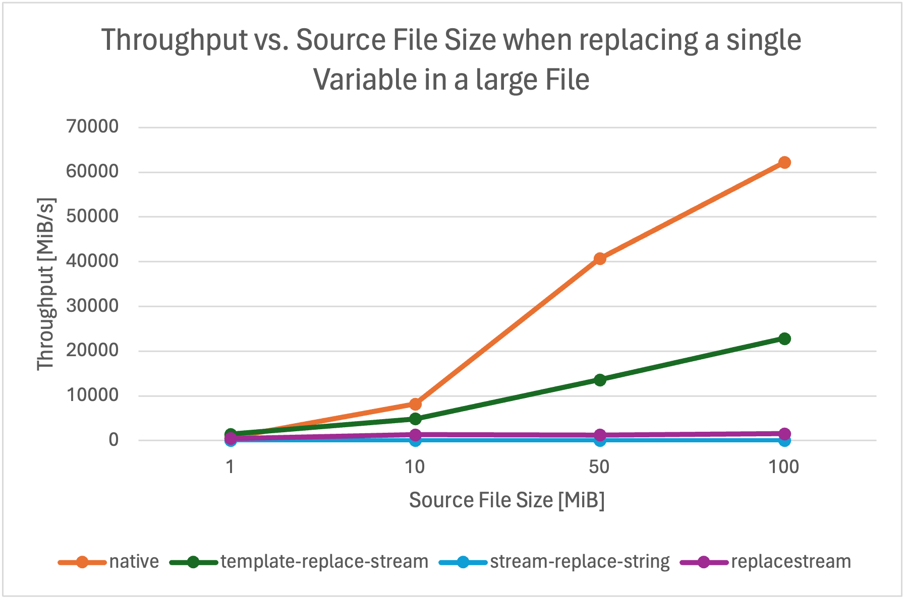
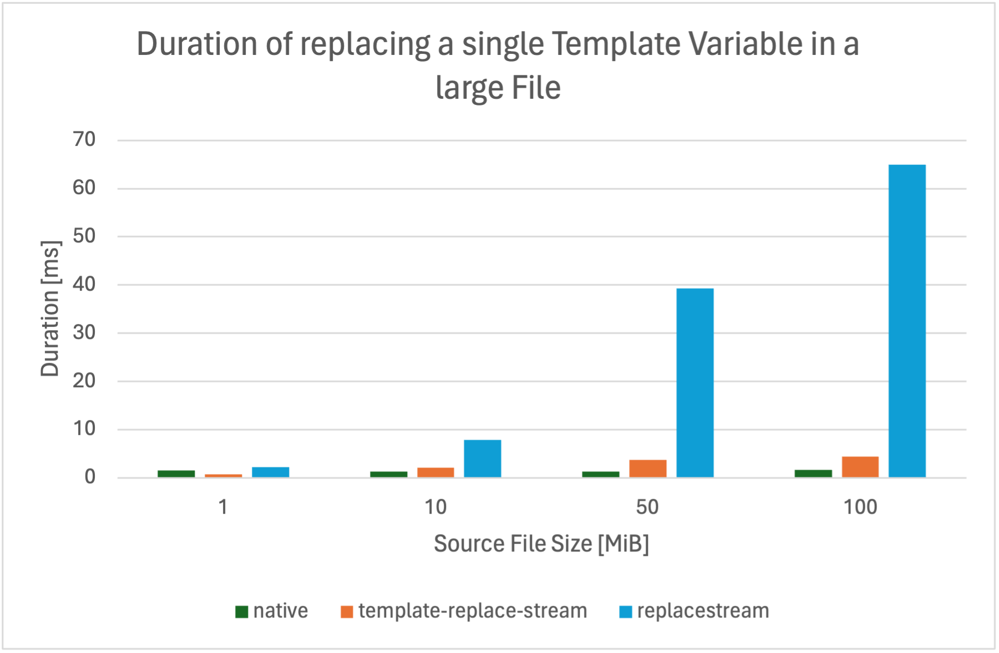

# template-replace-stream


A high performance `{{ template }}` replace stream working on binary or string streams.

This module is written in pure TypeScript, consists of only {{loc}} lines of code (including type definitions) and has no other dependencies. It is flexible and allows replacing an arbitrary wide range of template variables while being extremely fast (see [Benchmarks](#benchmarks)).

## Install

`npm install template-replace-stream`

This module can be imported via `require()` or `import` in JavaScript

## Usage

You create a `TemplateReplaceStream` by passing a source of template variables and their replacement values to the constructor. This may either be a map containing key-value pairs, or a function that returns a replacement value for a given template string.

### JavaScript

```js
{{ javascript-example.js }}
```

### TypeScript

```ts
{{ typescript-example.ts }}
```

### Advanced

#### Readable Stream as Replacement Value Source
It's also possible to pass another `Readable` as replacement value source to the `TemplateReplaceStream`. In fact, the README you are just reading was created using this feature. This makes it possible to replace template variables with whole files without reading them into a stream before.

<details>
<summary>Advanced Example Code</summary>

```ts
{{ create-readme.ts }}
```
</details>

### Options

```ts
type TemplateReplaceStreamOptions = {
  /** Default: `false`. If true, the stream creates logs on debug level */
  log: boolean;
  /**
   * Default: `false`. If true, the stream throws an error when a template variable has no
   * replacement value
   */
  throwOnUnmatchedTemplate: boolean;
  /**
   * Default: `100`. The maximum length of a variable name between a start and end pattern including
   * whitespaces around it. Any variable name longer than this length is ignored, i.e. the search
   * for the end pattern canceled and the stream looks for the next start pattern.
   * Note that a shorter length improves performance but may not find all variables.
   */
  maxVariableNameLength: number;
  /** Default: `'{{'`. The start pattern of a template string either as string or buffer */
  startPattern: string | Buffer;
  /** Default: `'}}'`. The end pattern of a template string either as string or buffer */
  endPattern: string | Buffer;
  /** Any options for the lower level {@link Transform} stream. Do not replace transform or flush */
  streamOptions?: TransformOptions;
}
```

## Benchmarks

The benchmarks were run on my MacBook Pro with an Apple M1 Pro Chip. The data source were virtual files generated from- and to memory to omit any bottleneck due to the file system. The "native" data refers to reading a files from disk without doing anything else with it (native `fs.Readable` streams). So they are the absolute highest possible.



Like the raw file system stream, a `TemplateReplaceStream` becomes faster with an increasing source file size. It is more than 20x faster than the `replace-stream` when processing large files. The throughput of the `TemplateReplaceStream` was almost 20GiB/s when replacing a single variable in a 100MiB file.



Replacing a single variable in a 100MiB file takes only 6ms using a `TemplateReplaceStream`. Reading the whole file from the disk alone takes already more than 1ms. The `stream-replace-string` packages was omitted im this graph, as it took over 16s to process the 100MiB file.

We will provide more benchmarks with the next release, especially with replacing a lot of variables.

## Changelog

### 2.1

- Add option `removeUnmatchedTemplate` that will always resolve unknown variables with an empty string, effectively removing the template string

### 2.0
- Drastically improve performance (by ~10x) by using `Buffer.indexOf()` instead of iterating over the buffer myself
- Rename option `throwOnMissingVariable` to `throwOnUnmatchedTemplate`
- Add benchmarks

## 1.1
- Update README