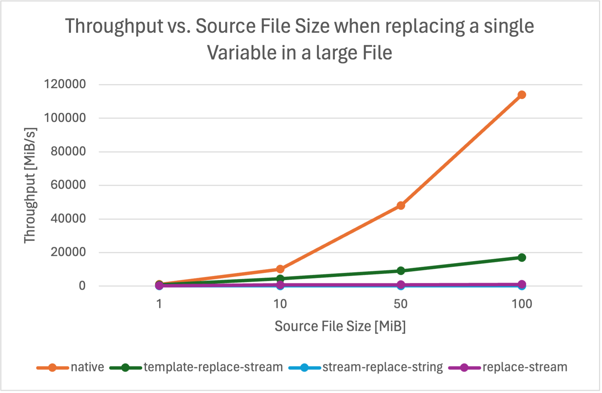
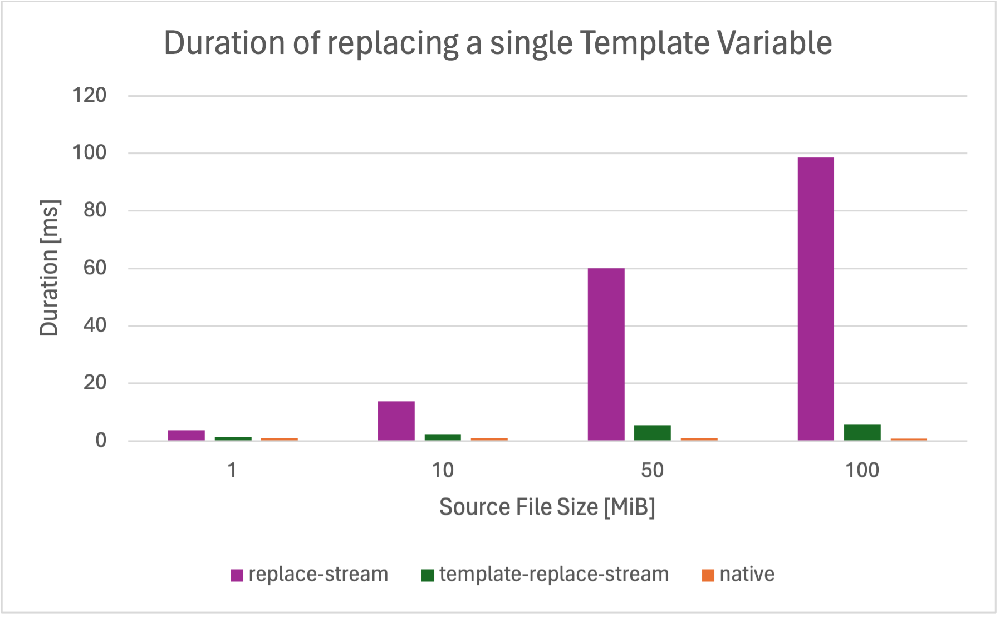
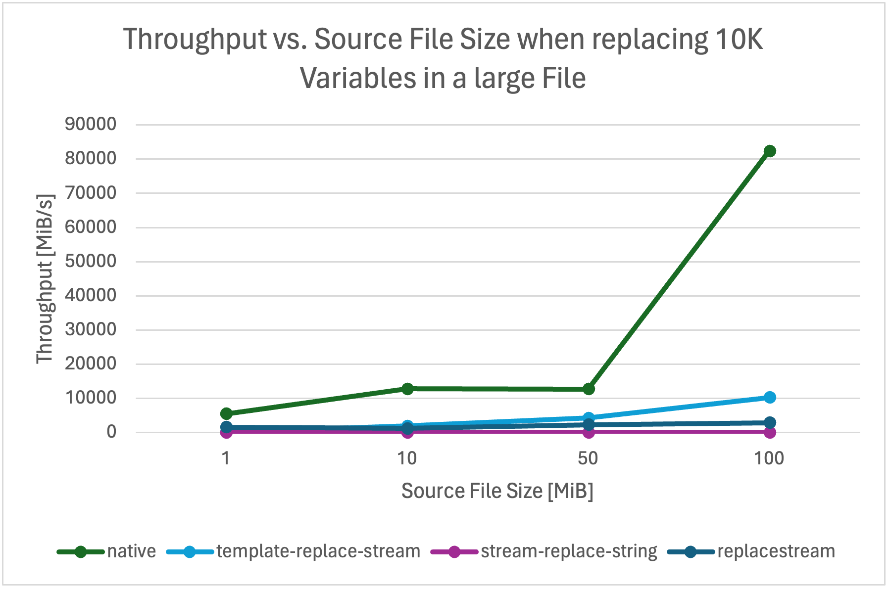
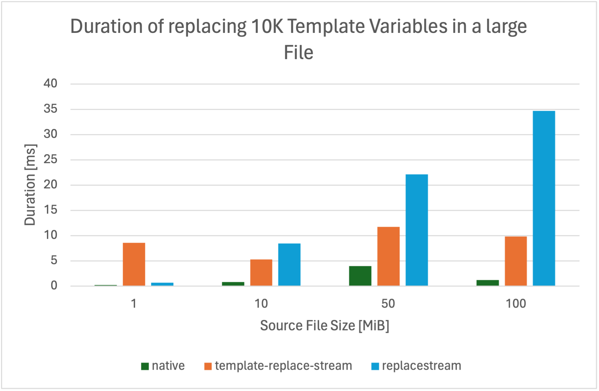

# template-replace-stream

[](https://github.com/SoulKa/template-replace-stream/actions/workflows/node.js.yml)
[](https://www.npmjs.com/package/template-replace-stream)
[](https://www.npmjs.com/package/template-replace-stream)

A high performance `{{ template }}` replace stream working on binary or string streams.

This module is written in pure TypeScript, consists of only {{loc}} lines of code (including type
definitions) and has no other dependencies. It is flexible and allows replacing an arbitrary wide
range of template variables while being extremely fast (we reached over 20GiB/s,
see [Benchmarks](#benchmarks)).

## Install

```bash
npm install template-replace-stream
```

This module contains type definitions and also an `.mjs` file for maximum compatibility.

### Supported Node.js Versions

The following Node.js versions are tested to work with the package. Older versions are not tested but should still be able to use it.

| 16.x | 18.x | 20.x | 22.x |
| --- | --- | --- | --- |
| [](https://github.com/SoulKa/template-replace-stream/actions/workflows/node.js.yml)   | [](https://github.com/SoulKa/template-replace-stream/actions/workflows/node.js.yml) | [](https://github.com/SoulKa/template-replace-stream/actions/workflows/node.js.yml) | [](https://github.com/SoulKa/template-replace-stream/actions/workflows/node.js.yml) |

## Usage

You create a `TemplateReplaceStream` by passing a source of template variables and their replacement
values to the constructor. This may either be a map containing key-value pairs, or a function that
returns a replacement value for a given template string.

### JavaScript

```js
{{ javascript-example.js }}
```

### TypeScript

```ts
{{ typescript-example.ts }}
```

### Advanced

#### Readable Stream as Replacement Value Source

It's also possible to pass another `Readable` as replacement value source to
the `TemplateReplaceStream`. In fact, the README you are just reading was created using this
feature. This makes it possible to replace template variables with whole files without reading them
into a stream before.

<details>
<summary>Advanced Example Code</summary>

```ts
{{ generate-readme.ts }}
```

</details>

### Options

```ts
{{ options-definition }}
```

## Benchmarks

The benchmarks were run on my MacBook Pro with an Apple M1 Pro Chip. The data source were virtual
files generated from- and to memory to omit any bottleneck due to the file system. The "native" data
refers to reading a virtual file without doing anything else with it (native `fs.Readable` streams).
So they are the absolute highest possible.

## Replacing a single Template Variable in a large File



Like the raw file system stream, a `TemplateReplaceStream` becomes faster with an increasing source
file size. It is more than 20x faster than the `replace-stream` when processing large files. The
throughput of the `TemplateReplaceStream` was more than 20GiB/s when replacing a single variable in
a 100MiB file.



Replacing a single variable in a 100MiB file takes only 6ms using a `TemplateReplaceStream`. Reading
the whole file from the disk alone takes already more than 1ms. The `stream-replace-string` packages
was omitted im this graph, as it took over 16s to process the 100MiB file.

## Replacing 10 thousand Template Variables in a large File



You can see that the performance declines when working with more replacements. Note that one reason
is the virtually generated workload (see "native" in the graph). `TemplateReplaceStream` still
reaches 10GiB/s.



To replace ten thousand template variables in a 100MiB file, the `TemplateReplaceStream` takes
around 10ms. Since this duration is similar for smaller file sizes, we can see that it does not
perform too well in the 1MiB file. We will keep optimizing for that.

## Changelog

### 2.1.2
- Add CI to repository
- Update README

### 2.1.1

- Fix stream ending when replacing a template with another stream during the last chunk of data
- Update README

### 2.1.0

- Further improve performance by using `Buffer.indexOf()` to find the end of a template variable,
  too
- Add more benchmarks

### 2.0.0

- Drastically improve performance (by ~10x) by using `Buffer.indexOf()` instead of iterating over
  the buffer myself
- Rename option `throwOnMissingVariable` to `throwOnUnmatchedTemplate`
- Add benchmarks

### 1.0.1

- Update README

### 1.0.0

- Initial Release