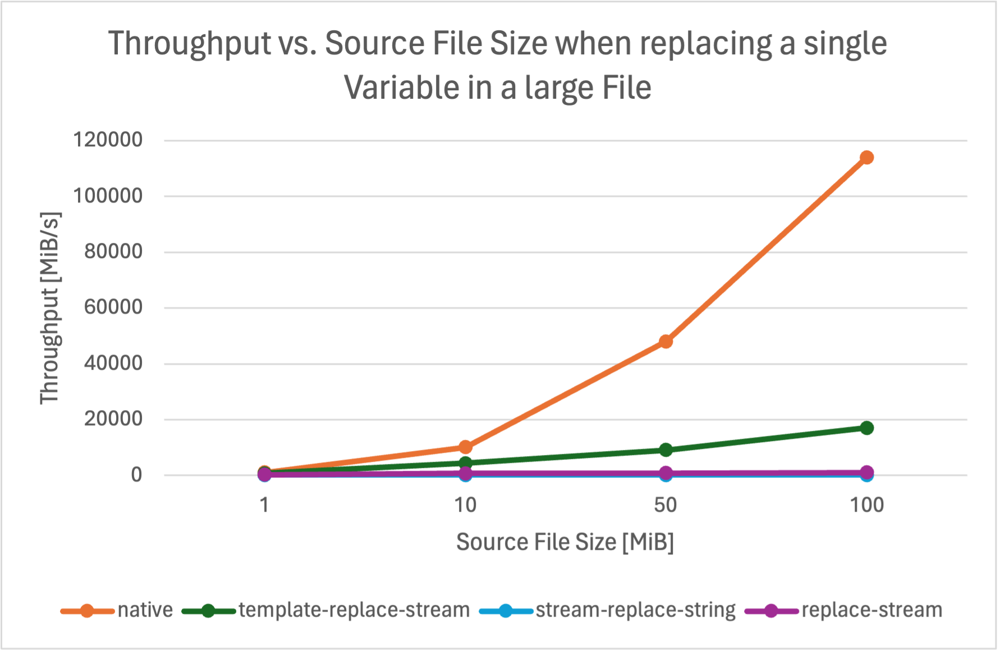
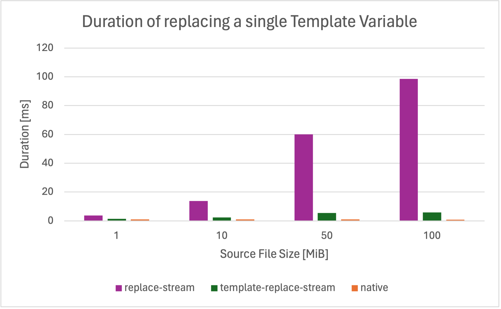
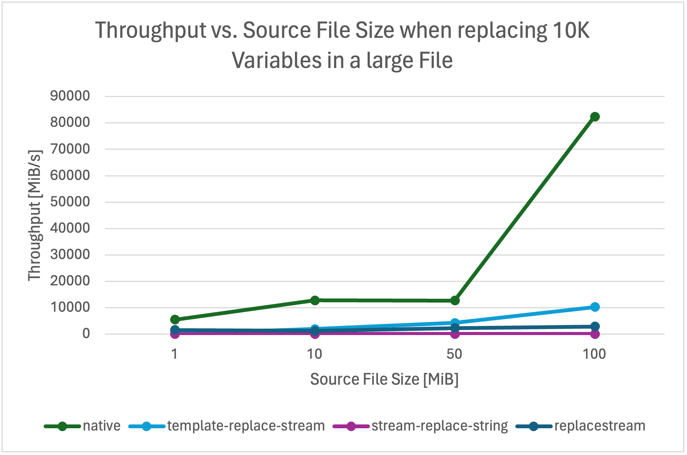
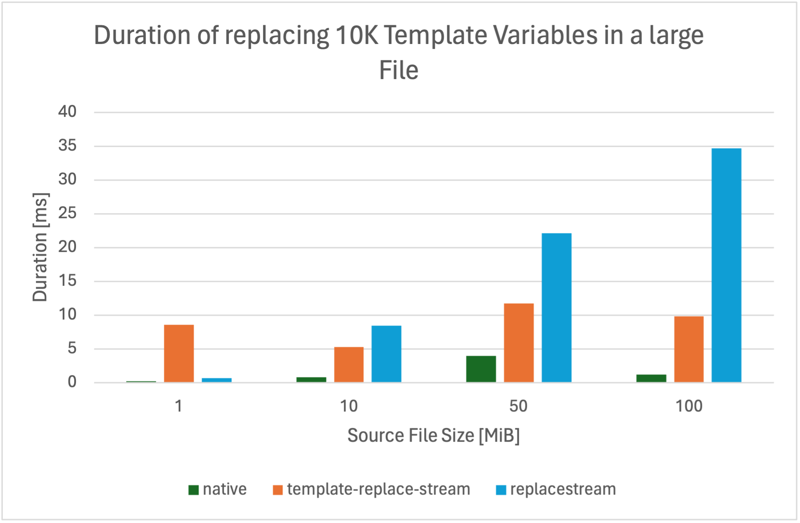

# template-replace-stream

[](https://github.com/SoulKa/template-replace-stream/actions/workflows/node.js.yml)
[](https://codecov.io/github/SoulKa/template-replace-stream)
[](https://www.npmjs.com/package/template-replace-stream)
[](https://www.npmjs.com/package/template-replace-stream)

A high performance `{{ template }}` replace stream working on binary or string streams.

This module is written in pure TypeScript, consists of only {{loc}} lines of code (including type
definitions) and has no other dependencies. It is flexible and allows replacing an arbitrarily wide
range of template variables while being extremely fast (we reached over 20GiB/s,
see [Benchmarks](#benchmarks)).

## Install

```bash
npm install template-replace-stream
```

This module is published as ESM only (`import`, no `require()`) and ships with TypeScript type
definitions. It requires Node.js `>=22`.

### Supported Node.js Versions

The CI runs the test suite on every Node.js release line from 22 on:

| 22.x | 23.x | 24.x | 25.x | 26.x |
| --- | --- | --- | --- | --- |
| [](https://github.com/SoulKa/template-replace-stream/actions/workflows/node.js.yml) | [](https://github.com/SoulKa/template-replace-stream/actions/workflows/node.js.yml) | [](https://github.com/SoulKa/template-replace-stream/actions/workflows/node.js.yml) | [](https://github.com/SoulKa/template-replace-stream/actions/workflows/node.js.yml) | [](https://github.com/SoulKa/template-replace-stream/actions/workflows/node.js.yml) |

## Usage

You create a `TemplateReplaceStream` by passing a source of template variables and their replacement
values to the constructor. This may either be a map containing key-value pairs, or a function that
returns a replacement value for a given template string. Variable names are trimmed, so
`{{ replace-me }}` (with surrounding whitespace) matches the key `"replace-me"`.

### JavaScript

This example replaces the template variables from a `Map`. Every occurrence of `{{ replace-me }}`
in the template file is replaced with the value stored under the key `"replace-me"`:

```js
{{ javascript-example.js }}
```

### TypeScript

The same works with a resolver function instead of a `Map`. It is called with each variable name
found in the template and returns the replacement value — a `string`, `Buffer`, `Readable`, or a
`Promise` of one of those:

```ts
{{ typescript-example.ts }}
```

### One-shot Replacement without Streams

If you just want the replaced result and don't need streaming, the static helpers
`replaceStringAsync()` (resolves to a `string`) and `replaceAsync()` (resolves to a `Buffer`) wrap
the whole pipeline in a single call. They hold the full output in memory, so avoid them for large
inputs:

```js
{{ async-example.js }}
```

### Advanced

#### Readable Stream as Replacement Value Source

It's also possible to pass another `Readable` as replacement value source to
the `TemplateReplaceStream`. In fact, the README you are just reading was created using this
feature. This makes it possible to replace template variables with whole files without reading them
into a stream before.

<details>
<summary>Advanced Example Code</summary>

```ts
{{ generate-readme.ts }}
```

</details>

### Options

```ts
{{ options-definition }}
```

### Error Handling

Every error the stream raises is a `TemplateReplaceStreamError` (or its `UnmatchedVariableError`
subclass) carrying a stable `code`. Prefer matching on `code` over the (human-readable) message.

| `code` | Cause |
| --- | --- |
| `ERR_INVALID_OPTION` | An invalid option was passed to the constructor (thrown synchronously). |
| `ERR_VARIABLE_NAME_TOO_LONG` | A variable name exceeded `maxVariableNameLength` (only when `throwOnUnmatchedTemplate` is enabled). |
| `ERR_UNMATCHED_VARIABLE` | A variable had no replacement value (only when `throwOnUnmatchedTemplate` is enabled). The `UnmatchedVariableError` subclass also exposes the name via `.variableName`. |
| `ERR_INVALID_CHUNK_TYPE` | A written chunk was neither a string nor a `Buffer` (only when `throwOnUnmatchedTemplate` is enabled; otherwise the chunk is passed through unmodified). |

Constructor errors are thrown synchronously; all others are emitted on the stream (or rejected by the
`replace*Async` helpers).

```ts
import { TemplateReplaceStream, UnmatchedVariableError } from "template-replace-stream";

try {
  await TemplateReplaceStream.replaceStringAsync("{{ name }}", new Map(), {
    throwOnUnmatchedTemplate: true,
  });
} catch (e) {
  if (e instanceof UnmatchedVariableError) console.error(`Missing variable: ${e.variableName}`);
}
```

## Benchmarks

The benchmarks were run on my MacBook Pro with an Apple M1 Pro Chip. The data sources were virtual
files generated from and to memory to omit any bottleneck due to the file system. The "native" data
refers to reading a virtual file without doing anything else with it (native `fs.Readable` streams),
so it marks the upper bound of what is possible.

### Replacing a single Template Variable in a large File



Like the raw file system stream, a `TemplateReplaceStream` becomes faster with an increasing source
file size. It is more than 20x faster than the `replace-stream` when processing large files. The
throughput of the `TemplateReplaceStream` was more than 20GiB/s when replacing a single variable in
a 100MiB file.



Replacing a single variable in a 100MiB file takes only 6ms using a `TemplateReplaceStream`. Reading
the whole file from the disk alone takes already more than 1ms. The `stream-replace-string` package
was omitted in this graph, as it took over 16s to process the 100MiB file.

### Replacing 10 thousand Template Variables in a large File



You can see that the performance declines when working with more replacements. Note that one reason
is the virtually generated workload (see "native" in the graph). `TemplateReplaceStream` still
reaches 10GiB/s.



To replace ten thousand template variables in a 100MiB file, the `TemplateReplaceStream` takes
around 10ms. Since this duration is similar for smaller file sizes, we can see that it does not
perform too well in the 1MiB file. We will keep optimizing for that.

## Changelog

### 3.0.1

- Fix `replaceAsync()` and `replaceStringAsync()` hanging when the input stream errors — the error
  now rejects the returned promise
- Fix a variable name of exactly `maxVariableNameLength` being treated as over-long — the limit is
  now inclusive
- Fix a replacement value `Readable` (e.g. an open file) leaking when the stream is destroyed
  mid-replacement — destroying the `TemplateReplaceStream` now also destroys the in-flight value
  stream
- Rework the examples: ESM-only JavaScript, a resolver function in TypeScript, and a new one-shot
  `replaceAsync()` example

### 3.0.0

- **Breaking:** the package is now ESM only and requires Node.js `>=22`. CommonJS `require()` is no
  longer supported.
- Add typed errors: every failure is now a `TemplateReplaceStreamError` (or its
  `UnmatchedVariableError` subclass) carrying a stable `code` (`ERR_INVALID_OPTION`,
  `ERR_VARIABLE_NAME_TOO_LONG`, `ERR_UNMATCHED_VARIABLE`, `ERR_INVALID_CHUNK_TYPE`).
  `UnmatchedVariableError` exposes the offending name via `.variableName`
- Fix a deadlock when a `Readable` replacement value larger than the readable buffer was consumed
  slowly
- Fix over-long variable names resolving inconsistently depending on how the input was chunked
- Fix self-overlapping and repeated-prefix start/end patterns being missed
- Fix an empty string (`""`) replacement value being treated as an unmatched template

### 2.2.0

- Add `TemplateReplaceStream.replaceAsync()` that directly returns a `Promise<Buffer>` with the result
- Add `TemplateReplaceStream.replaceStringAsync()` that directly returns a `Promise<string>` with the result
- Drop support for Node.js 16 and 18 (EOL) and add support for 24

### 2.1.2

- Support `async` replacement value functions (`Promise<StringSource>` as return value)
- Add CI to repository
- Update README

### 2.1.1

- Fix stream ending when replacing a template with another stream during the last chunk of data
- Update README

### 2.1.0

- Further improve performance by using `Buffer.indexOf()` to find the end of a template variable,
  too
- Add more benchmarks

### 2.0.0

- Drastically improve performance (by ~10x) by using `Buffer.indexOf()` instead of iterating over
  the buffer myself
- Rename option `throwOnMissingVariable` to `throwOnUnmatchedTemplate`
- Add benchmarks

### 1.0.1

- Update README

### 1.0.0

- Initial Release

## License

[MIT](LICENSE)